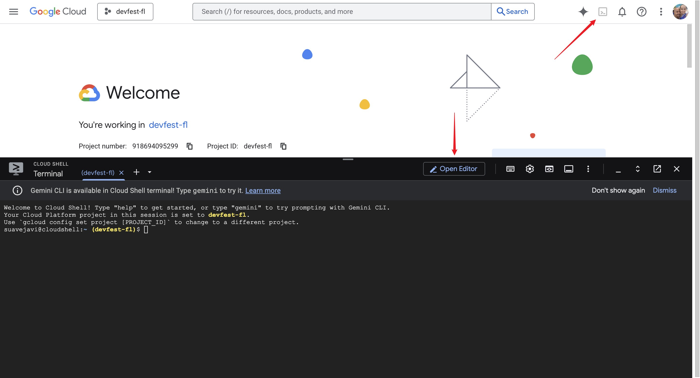
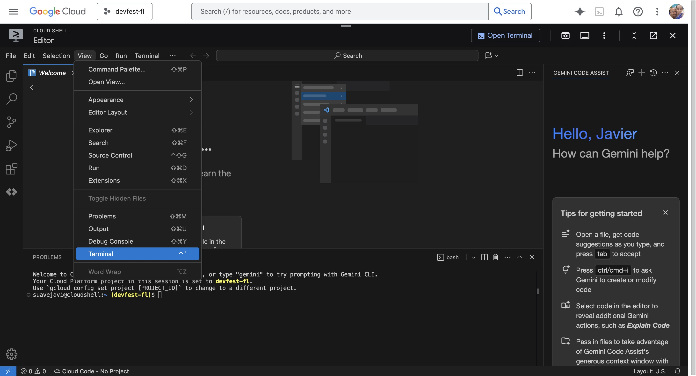
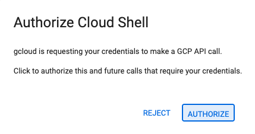

author: Javier Carrion
summary: Code to Cloud: Deploying a Full-Stack Angular App with Cloud Run & Cloud SQL
id: cloud-sql-cloud-run-angular-deployment
categories: backend,database,cloud,angular
environments: Web
status: Published
feedback_link: https://github.com/JavaVista/codevista-codelabs/issues

# Code to Cloud: Deploying a Full-Stack Angular App with Cloud Run & Cloud SQL

## Overview

Duration: 0:10:00

In this codelab, you'll learn how to deploy a full-stack application with a database to [Google Cloud](https://cloud.google.com/). You'll use the [Cloud SQL Node.js connector](https://github.com/GoogleCloudPlatform/cloud-sql-nodejs-connector) to connect a Node.js backend to a [Cloud SQL](https://cloud.google.com/sql) for [PostgreSQL](https://cloud.google.com/sql/postgresql) database, and an [Angular](https://angular.io/) frontend to interact with the backend.

### What you'll 

- How to create a Cloud SQL instance
- How to connect to Cloud SQL from a Node.js application
- How to create a simple Angular frontend
- How to deploy the application to Google Cloud

### What you'll need

- Laptop + Google account (free trial OK), and billing enabled
- A Google Cloud project
- A browser, such as Chrome or Firefox
- Familiarity with Node.js, Angular, and SQL

---

## Prerequisites

Duration: 0:10:00

Before you begin, ensure you have a [Google Account](https://accounts.google.com/SignUp).

- If you do not already have a Google account, you must create a Google account.
- Use a personal account instead of a work or school account. Work and school accounts may have restrictions that prevent you from enabling the APIs needed for this lab.

---

## Project Setup

Duration: 0:10:00

1. Sign-in to the [Google Cloud Console](https://console.cloud.google.com/).

   
2. Enable [billing](https://console.cloud.google.com/billing) in the Cloud Console.

   
   - Completing this lab should cost less than $1 USD in Cloud resources.
   - You can follow the steps at the end of this lab to delete resources to avoid further charges.
   - New users are eligible for the [($300 USD Free Trial)](http://cloud.google.com/free).

   
3. [Create a new project](https://console.cloud.google.com/projectcreate) or choose to reuse an existing project.

   
   > *Create a new project screen* 👆

   
   > *Reuse an existing project* 👆

---

## Open Cloud Shell Editor

Duration: 0:20:00

1. In your Project Welcome Screen click the **Cloud Shell Icon**  to open the **Cloud Shell** terminal.

    
2. In the Cloud Shell screen click **Open Editor**  to open the **Cloud Shell Editor**.

3. In the Cloud Shell Editor IDE open a terminal.
    - If the terminal doesn't appear on the bottom of the screen, open it:
      - In the menu bar click **View** and click **Terminal**.

      

4. In the terminal, we are going to set your project Id:
    - List all your project ids with

      ```bash
      gcloud projects list | awk '/PROJECT_ID/{print $2}'
      ```
    - Set your project id with

      ```bash
      gcloud config set project PROJECT_ID
      ```
      Replace `PROJECT_ID` with your project id. For example:

      ```bash
      gcloud config set project my-project-id
      ```

    - Verify your project id with

      ```bash
      gcloud config get-value project
      ```

      This should return your project id.

5. If prompted to authorize, click **Authorize** to continue.

    

6. You should see this message:

   ```bash
   Updated property [core/project].
   ```

   If you see a `WARNING` and are asked `Do you want to continue (Y/N)?`, then you have likely entered the project ID incorrectly. Press `N`, press `Enter`, double check your project ID and try to run the `gcloud config set project` command again.

---

## Enable Cloud APIs

Duration: 0:20:00

You need to enable the following **Google Cloud APIs**:

- **Cloud SQL Admin API**: To manage Cloud SQL instances.
- **Cloud Run API**: To deploy and manage containerized applications.
- **Artifact Registry API**: To store and manage container images.
- **Cloud Build API**: To build container images and other artifacts.
Run the following command in the Cloud Shell terminal to enable these APIs:

Run the following command in the **Cloud Shell terminal** to enable these APIs:

```bash
gcloud services enable \
  sqladmin.googleapis.com \
  run.googleapis.com \
  artifactregistry.googleapis.com \
  cloudbuild.googleapis.com
```

If prompted to authorize, click **Authorize** to continue.


This command may take a few minutes to complete, and you should see messages indicating that each service has been enabled.

Similar to this:

```bash
Operation "operations/acf.p2-73d90d00-47ee-447a-b600" finished successfully.
```

---

## Set up a Service Account

Duration: 0:10:00

A **service account** in Google Cloud is a special type of Google account that an application or a virtual machine (VM) can use to make authorized API calls. Unlike user accounts, which represent a human user, service accounts represent an application or a service. The provided commands set up a service account with specific permissions to allow a **Cloud Run** application to securely connect to and interact with a Cloud SQL database.

Create and configure a Google Cloud service account to be used by Cloud Run so that it has the correct permissions to connect to **Cloud SQL**.

1. Run the `gcloud iam service-accounts create` command as follows to create a new service account named `quickstart-service-account`:

    ```bash
    gcloud iam service-accounts create quickstart-service-account \
      --display-name="Quickstart Service Account"
    ```

2. Assign the **Cloud SQL Client** role to the service account. This role allows the service account to connect to Cloud SQL instances.

    ```bash
    gcloud projects add-iam-policy-binding ${GOOGLE_CLOUD_PROJECT} \
    --member="serviceAccount:quickstart-service-account@${GOOGLE_CLOUD_PROJECT}.iam.gserviceaccount.com" \
    --role="roles/cloudsql.client"
    ```

3. Assign the **Cloud SQL Instance User** role to the service account. This role allows the service account to perform operations on Cloud SQL instances.

    ```bash
    gcloud projects add-iam-policy-binding ${GOOGLE_CLOUD_PROJECT} \
    --member="serviceAccount:quickstart-service-account@${GOOGLE_CLOUD_PROJECT}.iam.gserviceaccount.com" \
    --role="roles/cloudsql.instanceUser"
    ```

4. Assign the **Log Writer** role to the service account. This role allows the service account to write logs to Google Cloud's logging service.

    ```bash
    gcloud projects add-iam-policy-binding ${GOOGLE_CLOUD_PROJECT} \
    --member="serviceAccount:quickstart-service-account@${GOOGLE_CLOUD_PROJECT}.iam.gserviceaccount.com" \
    --role="roles/logging.logWriter"
    ```
Why These Roles Are Needed

- **Cloud SQL Client**: Enables the service account to connect to Cloud SQL instances.
- **Cloud SQL Instance User**: Grants permissions to perform operations on Cloud SQL instances.
- **Log Writer**: Allows the service account to write logs, which is essential for monitoring and debugging.

These commands ensure that the service account has the necessary permissions to interact with Cloud SQL and log activities, which is essential for applications running on Cloud Run that need to access a Cloud SQL database.

---

## Frontend
Duration: 0:20:00

1.  **Create an Angular application**
    *   Install the Angular CLI: `npm install -g @angular/cli`
    *   Create a new Angular application: `ng new frontend`

2.  **Create a service to fetch data from the backend**
    *   Generate a new service: `ng generate service data`
    *   Add the following code to `data.service.ts`:

    ```typescript
    import { Injectable } from '@angular/core';
    import { HttpClient } from '@angular/common/http';

    @Injectable({
      providedIn: 'root'
    })
    export class DataService {
      constructor(private http: HttpClient) { }

      getData() {
        return this.http.get('/api', { responseType: 'text' });
      }
    }
    ```

3.  **Display the data in the component**
    *   Add the following code to `app.component.ts`:

    ```typescript
    import { Component, OnInit } from '@angular/core';
    import { DataService } from './data.service';

    @Component({
      selector: 'app-root',
      templateUrl: './app.component.html',
      styleUrls: ['./app.component.css']
    })
    export class AppComponent implements OnInit {
      data = '';

      constructor(private dataService: DataService) { }

      ngOnInit() {
        this.dataService.getData().subscribe(data => {
          this.data = data;
        });
      }
    }
    ```

    *   Add the following code to `app.component.html`:

    ```html
    <h1>{{ data }}</h1>
    ```

---

## Deployment
Duration: 0:10:00

1.  **Deploy the backend to Cloud Run**
    *   Create a `Dockerfile` for the backend:

    ```dockerfile
    FROM node:16
    WORKDIR /usr/src/app
    COPY package*.json ./
    RUN npm install
    COPY . .
    CMD [ "node", "index.js" ]
    ```

    *   Build and push the Docker image to Google Container Registry.
    *   Deploy the image to Cloud Run.

2.  **Deploy the frontend to Firebase Hosting**
    *   Initialize Firebase Hosting in your Angular project.
    *   Build the Angular application: `ng build --prod`
    *   Deploy the application to Firebase Hosting: `firebase deploy`
