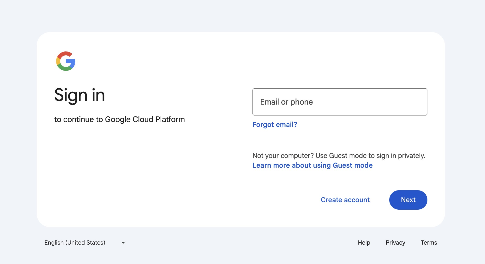
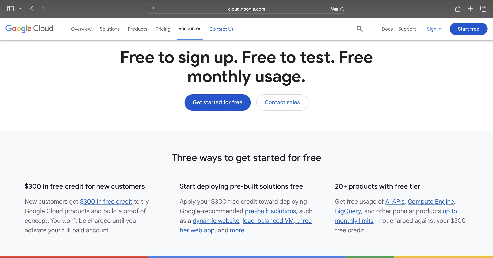
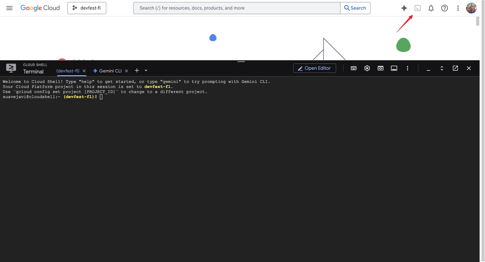
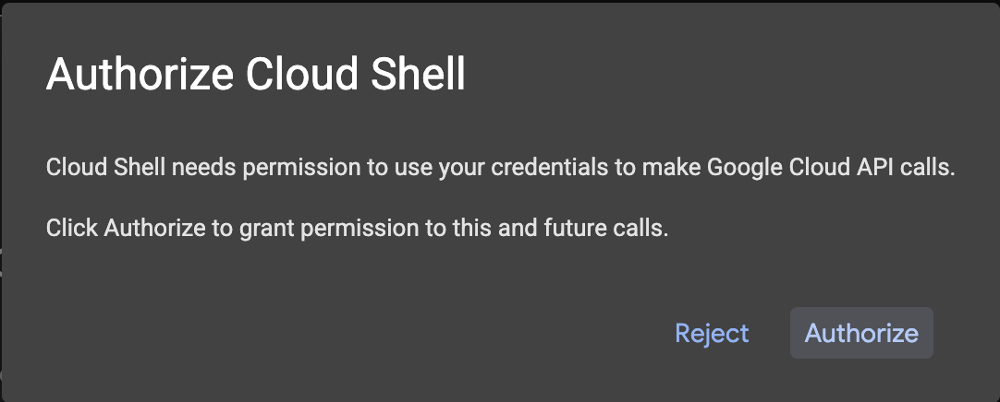
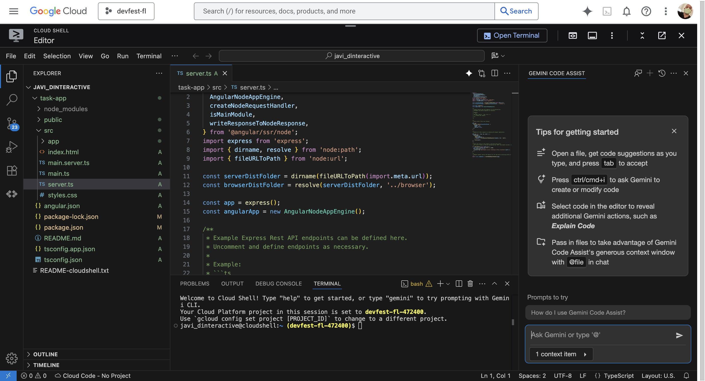
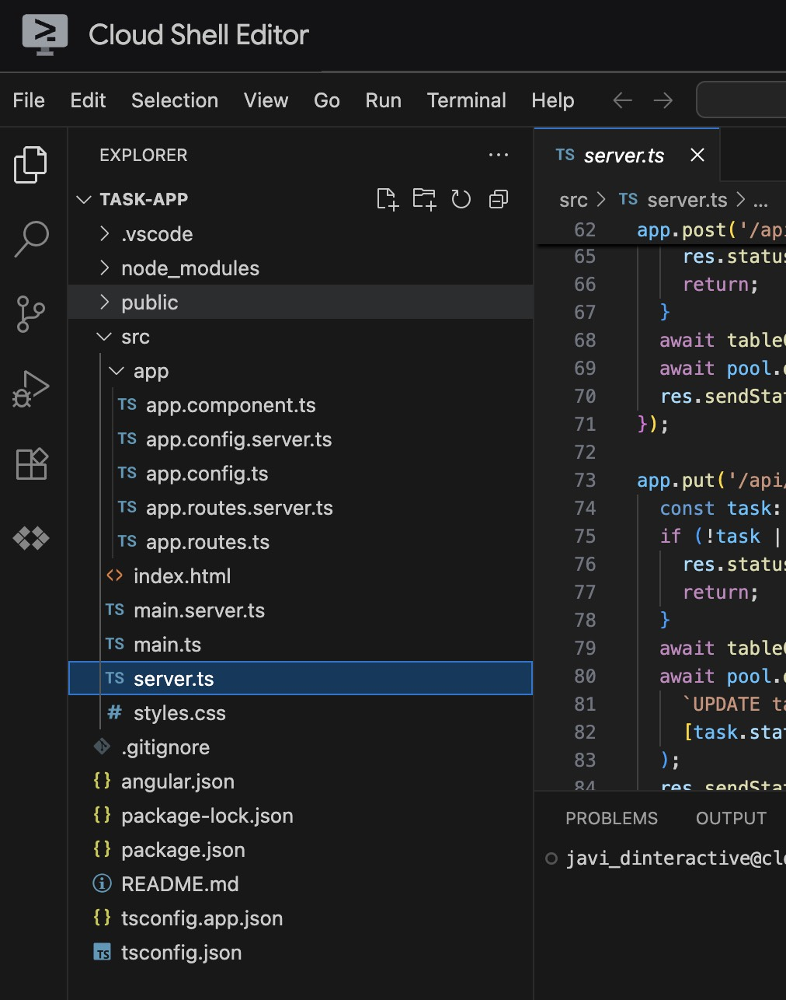
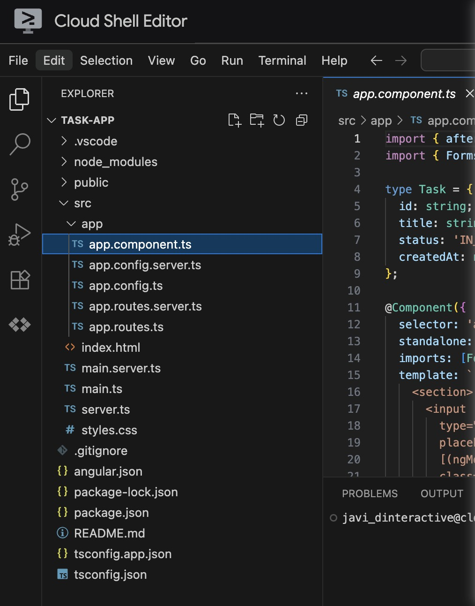

author: Javier Carrion
summary: Code to Cloud: Deploying a Full-Stack Angular App with Cloud Run & Cloud SQL
id: cloud-sql-cloud-run-angular-deployment
categories: backend,database,cloud,angular
environments: Web
status: Published
feedback_link: https://github.com/JavaVista/codevista-codelabs/issues

# Code to Cloud: Deploying a Full-Stack Angular App with Cloud Run & Cloud SQL

## Overview

Duration: 0:03:00

In this codelab, you'll learn how to deploy a full-stack application with a database to [Google Cloud](https://cloud.google.com/) 👉 [Cloud Run](https://cloud.google.com/run). Cloud Run is a fully managed platform that enables you to run your code directly on Google's scalable infrastructure. You'll use the [Cloud SQL Node.js connector](https://github.com/GoogleCloudPlatform/cloud-sql-nodejs-connector) to connect a Node.js backend to a [Cloud SQL](https://cloud.google.com/sql) for [PostgreSQL](https://cloud.google.com/sql/postgresql) database, and an [Angular](https://angular.io/) frontend to interact with the backend.

### What you'll

- How to create a Cloud SQL instance
- How to connect to Cloud SQL from a Node.js application
- How to create a simple Angular frontend
- How to deploy the application to Google Cloud

### What you'll need

- Laptop + Google account (free trial OK), and billing enabled
- A Google Cloud project
- A browser, such as Chrome or Firefox
- Familiarity with Node.js, Angular, and SQL

---

## Prerequisites

Duration: 0:03:00

Before you begin, ensure you have a **Google Account**.

- If you do not already have a Google account, you must [create a Google Account](https://accounts.google.com/SignUp).
- Use a personal account instead of a work or school account. Work and school accounts may have restrictions that prevent you from enabling the APIs needed for this lab.

---

## Project Setup

Duration: 0:06:00

1. Sign-in to the [Google Cloud Console](https://console.cloud.google.com/).

   

2. Enable [billing](https://console.cloud.google.com/billing) in the Cloud Console.

   

   - Completing this lab should cost less than $1 USD in Cloud resources.
   - You can follow the steps at the end of this lab to delete resources to avoid further charges.
   - New users are eligible for the [($300 USD Free Trial)](http://cloud.google.com/free).

   

3. [Create a new project](https://console.cloud.google.com/projectcreate) or choose to reuse an existing project.

   

   > *Create a new project screen* 👆

   

   > *Reuse an existing project* 👆

---

## Open the Cloud Shell

Duration: 0:10:00

1. In your Project Welcome Screen or in your Dashboard click the **Cloud Shell Icon** to open the **Cloud Shell Terminal**.

    

2. When prompted to authorize, click **Authorize** to continue.

    

3. In the terminal, we are going to set your project Id:

   - List all your project ids with

     ```bash
     gcloud projects list | awk '/PROJECT_ID/{print $2}'
     ```

   - Set your project id with

     ```bash
     gcloud config set project PROJECT_ID
     ```

     Replace `PROJECT_ID` with your project id. For example:

     ```bash
     gcloud config set project my-project-id
     ```

4. You should see this message:

   ```bash
   Updated property [core/project].
   ```

   If you see a **WARNING** and are asked `Do you want to continue (Y/N)?`, then you have likely entered the project ID incorrectly. Press `N`, press `Enter`, double check your project ID and try to run the `gcloud config set project` command again.

   - You can verify your project id with this command:

     ```bash
     gcloud config get-value project
     ```

      This should return your project id.

---

## Enable Cloud APIs

Duration: 0:07:00

You need to enable the following **Google Cloud APIs**:

- **Cloud SQL Admin API**: To manage Cloud SQL instances.
- **Cloud Run API**: To deploy and manage containerized applications.
- **Artifact Registry API**: To store and manage container images.
- **Cloud Build API**: To build container images and other artifacts.
  Run the following command in the Cloud Shell terminal to enable these APIs:

Run the following command in the **Cloud Shell terminal** to enable these APIs:

```bash
gcloud services enable \
  sqladmin.googleapis.com \
  run.googleapis.com \
  artifactregistry.googleapis.com \
  cloudbuild.googleapis.com
```

After a few moments, you should see a message indicating that each service has been successfully enabled.

Similar to this:

```bash
Operation "operations/acf.p2-73d90d00-47ee-447a-b600" finished successfully.
```

---

## Set up a Service Account

Duration: 0:05:00

A **service account** in Google Cloud is a special type of Google account that an application or a virtual machine (VM) can use to make authorized API calls. Unlike user accounts, which represent a human user, service accounts represent an application or a service. The provided commands set up a service account with specific permissions to allow a **Cloud Run** application to securely connect to and interact with a Cloud SQL database.

Create and configure a Google Cloud service account to be used by Cloud Run so that it has the correct permissions to connect to **Cloud SQL**.

1. Run the `gcloud iam service-accounts create` command as follows to create a new service account named `quickstart-service-account`:

   ```bash
   gcloud iam service-accounts create quickstart-service-account \
       --display-name="Quickstart Service Account"
   ```

2. Assign the **Cloud SQL Client** role to the service account. This role allows the service account to connect to Cloud SQL instances.

   ```bash
   gcloud projects add-iam-policy-binding ${GOOGLE_CLOUD_PROJECT} \
       --member="serviceAccount:quickstart-service-account@${GOOGLE_CLOUD_PROJECT}.iam.gserviceaccount.com" \
       --role="roles/cloudsql.client"
   ```

3. Assign the **Cloud SQL Instance User** role to the service account. This role allows the service account to perform operations on Cloud SQL instances.

   ```bash
   gcloud projects add-iam-policy-binding ${GOOGLE_CLOUD_PROJECT} \
       --member="serviceAccount:quickstart-service-account@${GOOGLE_CLOUD_PROJECT}.iam.gserviceaccount.com" \
       --role="roles/cloudsql.instanceUser"
   ```

4. Assign the **Log Writer** role to the service account. This role allows the service account to write logs to Google Cloud's logging service.

   ```bash
   gcloud projects add-iam-policy-binding ${GOOGLE_CLOUD_PROJECT} \
       --member="serviceAccount:quickstart-service-account@${GOOGLE_CLOUD_PROJECT}.iam.gserviceaccount.com" \
       --role="roles/logging.logWriter"
   ```

Why These Roles Are Needed

- **Cloud SQL Client**: Enables the service account to connect to Cloud SQL instances.
- **Cloud SQL Instance User**: Grants permissions to perform operations on Cloud SQL instances.
- **Log Writer**: Allows the service account to write logs, which is essential for monitoring and debugging.

These commands ensure that the service account has the necessary permissions to interact with Cloud SQL and log activities, which is essential for applications running on Cloud Run that need to access a Cloud SQL database.

---

## Create a Cloud SQL Database

Duration: 0:08:00

### Setup a PostgreSQL Database

1. **Create the Cloud SQL instance**

   - Run the following command to create a new **Cloud SQL instance**:

     ```bash
     gcloud sql instances create quickstart-instance \
         --database-version=POSTGRES_14 \
         --cpu=4 \
         --memory=16GB \
         --region=us-central1 \
         --database-flags=cloudsql.iam_authentication=on
     ```

       This command may take a few minutes to complete.

     - This command creates a managed PostgreSQL database instance in the `us-central1 region` with `4 CPUs` and `16GB of memory`.
     - The `cloudsql.iam_authentication=on` flag enables IAM-based authentication for secure access.

     Once the instance is created, you should see a message indicating that the operation was successful, similar to:

     ```bash
     Creating Cloud SQL instance for POSTGRES_14...done.
     Created [https://sqladmin.googleapis.com/sql/v1beta4/projects/principal-fact-471601-n1/instances/quickstart-instance].
     NAME: quickstart-instance
     DATABASE_VERSION: POSTGRES_14
     LOCATION: us-central1-c
     TIER: db-custom-4-16384
       PRIMARY_ADDRESS: 34.63.128.0
       PRIVATE_ADDRESS: -
       STATE: RUNNABLE
     ```

2. **Create a Cloud SQL database**

   - Run the following command to create a new database within the instance:

     ```bash
     gcloud sql databases create quickstart_db \
         --instance=quickstart-instance
     ```

     - This command creates a database named `quickstart_db` in the `quickstart-instance`.

3. **Create a PostgreSQL database user**

   - Run the following command to create a new user for the service account you created earlier to access the database:

     ```bash
     gcloud sql users create quickstart-service-account@${GOOGLE_CLOUD_PROJECT}.iam \
         --instance=quickstart-instance \
         --type=cloud_iam_service_account
     ```

---

## Prepare the Frontend Application

Duration: 0:05:00

### Create an Angular application

1. Prepare an **Angular application** that responds to HTTP requests.

    To create a new Angular project named `task-app`, use the command:

   ```bash
   npx --yes @angular/cli@19.2.5 new task-app \
       --minimal \
       --inline-template \
       --inline-style \
       --ssr \
       --server-routing \
       --defaults
   ```

   - The `npx` command runs the Angular CLI without needing to install it.

   - Type `n` when prompted with the following message:

     ```bash
       Would you like to share pseudonymous usage data about this project with the Angular Team ...
     ```

       This command creates a minimal Angular project with server-side rendering (SSR) and server-side routing enabled. Server-side rendering (SSR) is a technique where the server generates a fully rendered HTML page for each user request and sends it to the browser. This provides faster initial load times and better search engine optimization (SEO) compared to client-side rendering (where JavaScript builds the page in the browser). Server-side routing ensures that navigation between pages is handled on the server, improving performance and enabling deep linking.

2. Navigate to the project directory by changing the directory to `task-app`:

   ```bash
   cd task-app
   ```

3. Install **node-postgres** and the **Cloud SQL Node.js connector** libraries to interact with the **PostgreSQL** database, along with the TypeScript types for PostgreSQL as a development dependency:

   ```bash
   npm install pg \
   @google-cloud/cloud-sql-connector \
   google-auth-library \
   @types/pg --save-dev
   ```

   - The `pg` library is used to interact with your PostgreSQL database.
   - The `@google-cloud/cloud-sql-connector` library provides a way to connect to Cloud SQL instances securely.
   - The `google-auth-library` is used for authenticating requests to Google Cloud services.

4. To enable TypeScript support for PostgreSQL in your Angular application, install the `@types/pg` package as a development dependency:

    ```bash
    npm install --save-dev @types/pg
    ```

5. In the Cloud Shell screen click **Open Editor** to open the **Cloud Shell Editor**.

    
    This is where you will modify the backend server and frontend application in the next steps.

---

## Set up the Backend Server

Duration: 0:05:00

1. Set up the backend server. Open the `server.ts` file in the **Cloud Shell Editor**. Navigate to the `src` folder and locate the `server.ts` file.

    

    or open it using the following command:

   ```bash
   cloudshell edit src/server.ts
   ```

2. Delete the existing contents of the `server.ts` file.

3. Copy the following code and paste it into the opened `server.ts` file:

   ```typescript
   import {
     AngularNodeAppEngine,
     createNodeRequestHandler,
     isMainModule,
     writeResponseToNodeResponse,
   } from '@angular/ssr/node';
   import express from 'express';
   import { dirname, resolve } from 'node:path';
   import { fileURLToPath } from 'node:url';
   import pg from 'pg';
   import { AuthTypes, Connector } from '@google-cloud/cloud-sql-connector';
   import { GoogleAuth } from 'google-auth-library';
   const auth = new GoogleAuth();
   
   const { Pool } = pg;
   
   type Task = {
     id: string;
     title: string;
     status: 'IN_PROGRESS' | 'COMPLETE';
     createdAt: number;
   };
   
   const projectId = await auth.getProjectId();
   
   const connector = new Connector();
   const clientOpts = await connector.getOptions({
     instanceConnectionName: `${projectId}:us-central1:quickstart-instance`,
     authType: AuthTypes.IAM,
   });
   
   const pool = new Pool({
     ...clientOpts,
     user: `quickstart-service-account@${projectId}.iam`,
     database: 'quickstart_db',
   });
   
   const tableCreationIfDoesNotExist = async () => {
     await pool.query(`CREATE TABLE IF NOT EXISTS tasks (
         id SERIAL NOT NULL,
         created_at timestamp NOT NULL,
         status VARCHAR(255) NOT NULL default 'IN_PROGRESS',
         title VARCHAR(1024) NOT NULL,
         PRIMARY KEY (id)
       );`);
   }
   
   const serverDistFolder = dirname(fileURLToPath(import.meta.url));
   const browserDistFolder = resolve(serverDistFolder, '../browser');
   
   const app = express();
   const angularApp = new AngularNodeAppEngine();
   
   app.use(express.json());
   
   app.get('/api/tasks', async (req, res) => {
     await tableCreationIfDoesNotExist();
     const { rows } = await pool.query(`SELECT id, created_at, status, title FROM tasks ORDER BY created_at DESC LIMIT 100`);
     res.send(rows);
   });
   
   app.post('/api/tasks', async (req, res) => {
     const newTaskTitle = req.body.title;
     if (!newTaskTitle) {
       res.status(400).send("Title is required");
       return;
     }
     await tableCreationIfDoesNotExist();
     await pool.query(`INSERT INTO tasks(created_at, status, title) VALUES(NOW(), 'IN_PROGRESS', $1)`, [newTaskTitle]);
     res.sendStatus(200);
   });
   
   app.put('/api/tasks', async (req, res) => {
     const task: Task = req.body;
     if (!task || !task.id || !task.title || !task.status) {
       res.status(400).send("Invalid task data");
       return;
     }
     await tableCreationIfDoesNotExist();
     await pool.query(
       `UPDATE tasks SET status = $1, title = $2 WHERE id = $3`,
       [task.status, task.title, task.id]
     );
     res.sendStatus(200);
   });
   
   app.delete('/api/tasks', async (req, res) => {
     const task: Task = req.body;
     if (!task || !task.id) {
       res.status(400).send("Task ID is required");
       return;
     }
     await tableCreationIfDoesNotExist();
     await pool.query(`DELETE FROM tasks WHERE id = $1`, [task.id]);
     res.sendStatus(200);
   });
   
   /**
   * Serve static files from /browser
   */
   app.use(
     express.static(browserDistFolder, {
       maxAge: '1y',
       index: false,
       redirect: false,
     }),
   );
   
   /**
   * Handle all other requests by rendering the Angular application.
   */
   app.use('/**', (req, res, next) => {
     angularApp
       .handle(req)
       .then((response) =>
         response ? writeResponseToNodeResponse(response, res) : next(),
       )
       .catch(next);
   });
   
   /**
   * Start the server if this module is the main entry point.
   * The server listens on the port defined by the `PORT` environment variable, or defaults to 4000.
   */
   if (isMainModule(import.meta.url)) {
     const port = process.env['PORT'] || 4000;
     app.listen(port, () => {
       console.log(`Node Express server listening on http://localhost:${port}`);
     });
   }
   
   /**
   * Request handler used by the Angular CLI (for dev-server and during build) or Firebase Cloud Functions.
   */
   export const reqHandler = createNodeRequestHandler(app);
   ```

   - The file sets up the Express server to handle API requests and to connect to the PostgreSQL database.
   - The `tableCreationIfDoesNotExist` function ensures that the tasks table is created if it doesn't already exist.

4. Save the file.

---

## Modify the Frontend

Duration: 0:05:00

1. Navigate to the `src` folder and open the `app.component.ts` file

    

    or open it using the following command:

   ```bash
   cloudshell edit src/app.component.ts
   ```

2. Delete the existing contents of the `app.component.ts` file.

3. Add the following code to the `app.component.ts` file:

   ```typescript
   import { afterNextRender, Component, signal } from '@angular/core';
   import { FormsModule } from '@angular/forms';
   
   type Task = {
     id: string;
     title: string;
     status: 'IN_PROGRESS' | 'COMPLETE';
     createdAt: number;
   };
   
   @Component({
     selector: 'app-root',
     standalone: true,
     imports: [FormsModule],
     template: `
       <section>
         <input
           type="text"
           placeholder="New Task Title"
           [(ngModel)]="newTaskTitle"
           class="text-black border-2 p-2 m-2 rounded"
         />
         <button (click)="addTask()">Add new task</button>
         <table>
           <tbody>
             @for (task of tasks(); track task) {
               @let isComplete = task.status === 'COMPLETE';
               <tr>
                 <td>
                   <input
                     (click)="updateTask(task, { status: isComplete ? 'IN_PROGRESS' : 'COMPLETE' })"
                     type="checkbox"
                     [checked]="isComplete"
                   />
                 </td>
                 <td>{{ task.title }}</td>
                 <td>{{ task.status }}</td>
                 <td>
                   <button (click)="deleteTask(task)">Delete</button>
                 </td>
               </tr>
             }
           </tbody>
         </table>
       </section>
     `,
     styles: '',
   })
   export class AppComponent {
     newTaskTitle = '';
     tasks = signal<Task[]>([]);
   
     constructor() {
       afterNextRender({
         earlyRead: () => this.getTasks()
       });
     }
   
     async getTasks() {
       const response = await fetch(`/api/tasks`);
       const tasks = await response.json();
       this.tasks.set(tasks);
     }
   
     async addTask() {
       await fetch(`/api/tasks`, {
         method: 'POST',
         headers: { 'Content-Type': 'application/json' },
         body: JSON.stringify({
           title: this.newTaskTitle,
           status: 'IN_PROGRESS',
           createdAt: Date.now(),
         }),
       });
       this.newTaskTitle = '';
       await this.getTasks();
     }
   
     async updateTask(task: Task, newTaskValues: Partial<Task>) {
       await fetch(`/api/tasks`, {
         method: 'PUT',
         headers: { 'Content-Type': 'application/json' },
         body: JSON.stringify({ ...task, ...newTaskValues }),
       });
       await this.getTasks();
     }
   
     async deleteTask(task: any) {
       await fetch('/api/tasks', {
         method: 'DELETE',
         headers: { 'Content-Type': 'application/json' },
         body: JSON.stringify(task),
       });
       await this.getTasks();
     }
   }
   ```

4. Save the file.

The application is now ready to be deployed.

---

## Deploy the application to Cloud Run

Duration: 0:05:00

Click **Open Terminal** to open the **Cloud Shell terminal** and ensure you are in the `task-app` directory. If you are not, navigate to it using:

```bash
cd ~/task-app
```

1. Run the command below to deploy your application to **Cloud Run**.

   ```bash
   gcloud run deploy to-do-tracker \
      --region=us-central1 \
      --source=. \
      --service-account="quickstart-service-account@${GOOGLE_CLOUD_PROJECT}.iam.gserviceaccount.com" \
      --allow-unauthenticated
   ```

    Cloud Run uses [**Cloud Native Buildpacks**](https://cloud.google.com/docs/buildpacks/overview) to build a Docker image from your source code. This process requires no Dockerfile and sets permissions via the service account, allowing unauthenticated access.

   - `--region=us-central1`: Specifies the region where the service will be deployed.
   - `--source=.`: Deploys the application from the current directory.
   - `--service-account`: Specifies the service account to use for the deployment. Use the `quickstart-service-account` created earlier.
   - `--allow-unauthenticated`: Allows public access to the application.

2. When prompted, type `y` and `Enter` to confirm that you would like to continue:

   ```bash
   Do you want to continue (Y/n)? Y
   ```

    After a few minutes, the application should provide a URL for you to visit.

Navigate to the URL to see your application in action. Every time you visit the URL or refresh the page, you will see the task app.

### Test the application

Use the application to add, update, and delete tasks. Verify that the backend and database are working as expected.

You can use tools like Postman or curl to test the API endpoints directly.

---

## Congratulations 🎉

Duration: 0:03:00

You have successfully deployed a full-stack Angular application to Google Cloud Run with a Cloud SQL backend. This application allows you to manage tasks and will scale automatically based on demand.

In this lab, you have learned how to do the following:

- Create a Cloud SQL for PostgreSQL instance
- Deploy an application to Cloud Run that connects to your Cloud SQL database
- Set up an Angular frontend that interacts with the backend API

### Cleanup Instructions

Cloud SQL does not have a free tier and will charge you if you continue to use it. To avoid incurring unnecessary costs, delete the Cloud project after completing the codelab.

While Cloud Run does not charge when the service is not in use, you might still be charged for storing the container image in Artifact Registry. Deleting your Cloud project stops billing for all the resources used within that project.

### Delete the Cloud Project

To delete the entire project and stop all billing:

```bash
gcloud projects delete ${GOOGLE_CLOUD_PROJECT}
```

#### Optional: Delete Specific Resources

If you prefer not to delete the entire project, you can delete individual resources:

1. Delete the **Cloud SQL instance**:

   ```bash
   gcloud sql instances delete quickstart-instance --quiet
   ```

2. Delete the **Cloud Run service**:

   ```bash
   gcloud run services delete to-do-tracker --region=us-central1 --quiet
   ```

3. Delete the codelab project directory:

   ```bash
   rm -rf ~/task-app
   ```

4. **Warning!** This next action is can't be undone! If you would like to delete everything on your Cloud Shell to free up space, you can [**delete your whole home directory**](https://cloud.google.com/shell/docs/resetting-cloud-shell). Be careful that everything you want to keep is saved somewhere else.

   ```bash
   sudo rm -rf $HOME
   ```

    In the Cloud Shell menu, click **More** > **Restart**. Confirm the restart to provision a new VM and reset the home directory to its default state.

### Resources 📚

- [Google Cloud Run Documentation](https://cloud.google.com/run/docs)
- [Google Cloud SQL Documentation](https://cloud.google.com/sql/docs)
- [Angular Documentation](https://angular.dev/overview)
- [Google Cloud Shell - How-to Guides](https://cloud.google.com/shell/docs/how-to)

### Thank you 🙏

I hope you found this codelab helpful in understanding how to deploy a full-stack Angular application to Google Cloud Run with a Cloud SQL backend.

#### Feedback

I value your feedback! If you have any suggestions or encounter issues, please let us know by submitting feedback at [GitHub Issues](https://github.com/JavaVista/codevista-codelabs/issues).

---
