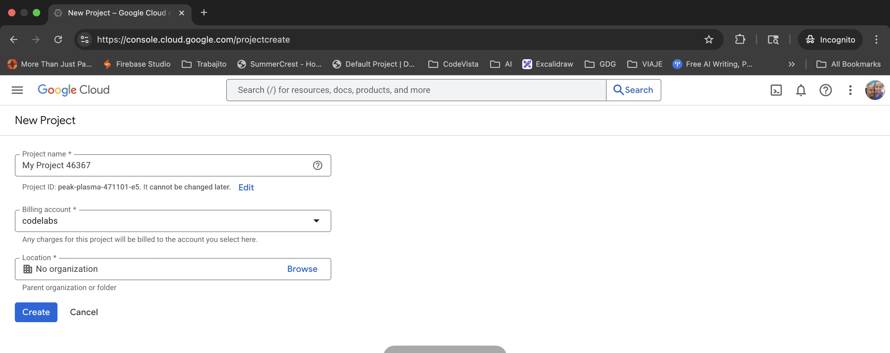

author: Javier Carrion
summary: Code to Cloud: Deploying a Full-Stack Angular App with Cloud Run & Cloud SQL
id: cloud-sql-cloud-run-angular-deployment
categories: backend,database,cloud,angular
environments: Web
status: Published
feedback_link: https://github.com/JavaVista/codevista-codelabs/issues

# Code to Cloud: Deploying a Full-Stack Angular App with Cloud Run & Cloud SQL

## Overview

Duration: 0:10:00

In this codelab, you'll learn how to deploy a full-stack application with a database to [Google Cloud](https://cloud.google.com/). You'll use the [Cloud SQL Node.js connector](https://github.com/GoogleCloudPlatform/cloud-sql-nodejs-connector) to connect a Node.js backend to a [Cloud SQL](https://cloud.google.com/sql) for [PostgreSQL](https://cloud.google.com/sql/postgresql) database, and an [Angular](https://angular.io/) frontend to interact with the backend.

### What you'll 

- How to create a Cloud SQL instance
- How to connect to Cloud SQL from a Node.js application
- How to create a simple Angular frontend
- How to deploy the application to Google Cloud

### What you'll need

- Laptop + Google account (free trial OK), and billing enabled
- A Google Cloud project
- A browser, such as Chrome or Firefox
- Familiarity with Node.js, Angular, and SQL

---

## Prerequisites

Duration: 0:10:00

Before you begin, ensure you have a [Google Account](https://accounts.google.com/SignUp).

- If you do not already have a Google account, you must create a Google account.
- Use a personal account instead of a work or school account. Work and school accounts may have restrictions that prevent you from enabling the APIs needed for this lab.

---

## Project Setup

Duration: 0:10:00

1. Sign-in to the [Google Cloud Console](https://console.cloud.google.com/).
   
2. Enable [billing](https://console.cloud.google.com/billing) in the Cloud Console.
   
   - Completing this lab should cost less than $1 USD in Cloud resources.
   - You can follow the steps at the end of this lab to delete resources to avoid further charges.
   - New users are eligible for the [($300 USD Free Trial)](http://cloud.google.com/free).
   
3. [Create a new project](https://console.cloud.google.com/projectcreate) or choose to reuse an existing project.
   
   > *Create a new project screen* 👆

   
   > *Reuse an existing project* 👆

---

## Open Cloud Shell Editor

Duration: 0:20:00

1. In your Project Welcome Screen click the **Cloud Shell Icon**  to open the **Cloud Shell** terminal.
    
2. In the Cloud Shell screen click **Open Editor**  to open the **Cloud Shell Editor**.
3. In the Cloud Shell Editor IDE open a terminal.
    - If the terminal doesn't appear on the bottom of the screen, open it:
      - In the menu bar click **View** and click **Terminal**.
      

4. In the terminal, we are going to set your project Id:
    - List all your project ids with

      ```bash
      gcloud projects list | awk '/PROJECT_ID/{print $2}'
      ```
    - Set your project id with

      ```bash
      gcloud config set project PROJECT_ID
      ```
      Replace `PROJECT_ID` with your project id. For example:

      ```bash
      gcloud config set project my-project-id
      ```

    - Verify your project id with

      ```bash
      gcloud config get-value project
      ```

      This should return your project id.

5. If prompted to authorize, click **Authorize** to continue.

6. You should see this message:

   ```bash
   Updated property [core/project].
   ```

   If you see a `WARNING` and are asked `Do you want to continue (Y/N)?`, then you have likely entered the project ID incorrectly. Press `N`, press `Enter`, double check your project ID and try to run the `gcloud config set project` command again.

---

## Frontend
Duration: 0:20:00

1.  **Create an Angular application**
    *   Install the Angular CLI: `npm install -g @angular/cli`
    *   Create a new Angular application: `ng new frontend`

2.  **Create a service to fetch data from the backend**
    *   Generate a new service: `ng generate service data`
    *   Add the following code to `data.service.ts`:

    ```typescript
    import { Injectable } from '@angular/core';
    import { HttpClient } from '@angular/common/http';

    @Injectable({
      providedIn: 'root'
    })
    export class DataService {
      constructor(private http: HttpClient) { }

      getData() {
        return this.http.get('/api', { responseType: 'text' });
      }
    }
    ```

3.  **Display the data in the component**
    *   Add the following code to `app.component.ts`:

    ```typescript
    import { Component, OnInit } from '@angular/core';
    import { DataService } from './data.service';

    @Component({
      selector: 'app-root',
      templateUrl: './app.component.html',
      styleUrls: ['./app.component.css']
    })
    export class AppComponent implements OnInit {
      data = '';

      constructor(private dataService: DataService) { }

      ngOnInit() {
        this.dataService.getData().subscribe(data => {
          this.data = data;
        });
      }
    }
    ```

    *   Add the following code to `app.component.html`:

    ```html
    <h1>{{ data }}</h1>
    ```

---

## Deployment
Duration: 0:10:00

1.  **Deploy the backend to Cloud Run**
    *   Create a `Dockerfile` for the backend:

    ```dockerfile
    FROM node:16
    WORKDIR /usr/src/app
    COPY package*.json ./
    RUN npm install
    COPY . .
    CMD [ "node", "index.js" ]
    ```

    *   Build and push the Docker image to Google Container Registry.
    *   Deploy the image to Cloud Run.

2.  **Deploy the frontend to Firebase Hosting**
    *   Initialize Firebase Hosting in your Angular project.
    *   Build the Angular application: `ng build --prod`
    *   Deploy the application to Firebase Hosting: `firebase deploy`
